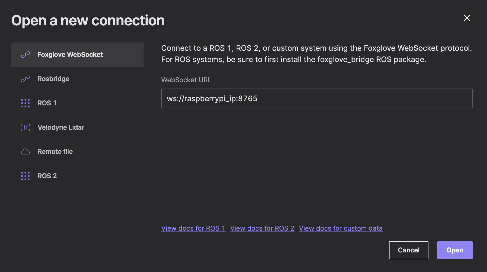

# Инструкция по подключению и взаимодействию с Raspberry Pi 5
1.	**Подключение к распберри пай**
    а) Назвать свою точку доступа “kkklll”, пароль – “123456780”; после включения распберри пай подключится и можно будет с ним взаимодейстовать
    б) Подключится по ethernet кабелю
        После подключения можно подключить другой вайфай
    ```bash
    sudo raspi-config
    ```
    Перейти в параметры устройства и вайфай подключения, далее установить желаемое подключение.
    в) Подключить мышку, клавиатуру и монитор напрямую к устройству, взаимодействовать там
2.  **Сразу после первого перезагрузить устройство командой**
    ```bash
    sudo reboot
    ```
    для того, чтобы инерциальный модуль смог откалиброваться (нужно подождать 30 секунд)
3. **Запустить докер контейнер**
    ```bash
    ./run_container.sh
    ```
4. **В докере зайти в папку /home и запустить ноды**
    ```bash
    cd /home
    ./run_nodes.sh --all
    ```
    Можно запускать разные ноды используя разные флаги, чтобы посмотреть все флаги, нужно написать
    ```bash
    ./run_nodes.sh
    ```
5. **Чтобы подключить фоксглов, надо скачать его по ссылке https://foxglove.dev/download**
    После нужно в хосте распберри пай написать
    ```bash
    ifconfig # смотрите поле айпи именно того интерфейса,
             # по которому подключено устройство
    ```
    чтобы узнать, какое айпи имеет устройство
    Далее нужно зайти в фоксглов, нажать "open connections", изменить localhost на найденный айпи устройства:
    
6. **Далее нужно настроить фоксглов, выставить нужные виджеты для мониторинга.** 
Для изображения выбирать топик /camera/image_raw/compressed, можно промониторить информацию с иму или с орбслема, выбрать raw_messages формат виджета и топик /imu/data_raw и /odometry/slam соответственно.

### Дополнительно
Для передачи бинарных данных работы иму, надо вытащить сбоку из корпуса sd карту, вставить в любое устройство и скачать оттуда .bin файлы.


#### Contacts
При возникновении вопросов - *t.me/rougenn* 
6. **Далее нужно настроить фоксглов, выставить нужные виджеты для мониторинга.** 
Для изображения выбирать топик /camera/image_raw/compressed, можно промониторить информацию с иму или с орбслема, выбрать raw_messages формат виджета и топик /imu/data_raw и /odometry/slam соответственно.

### Дополнительно
Для передачи бинарных данных работы иму, надо вытащить сбоку из корпуса sd карту, вставить в любое устройство и скачать оттуда .bin файлы.


#### Contacts
При возникновении вопросов - *[t.me/rougenn](https://t.me/rougenn)* 
