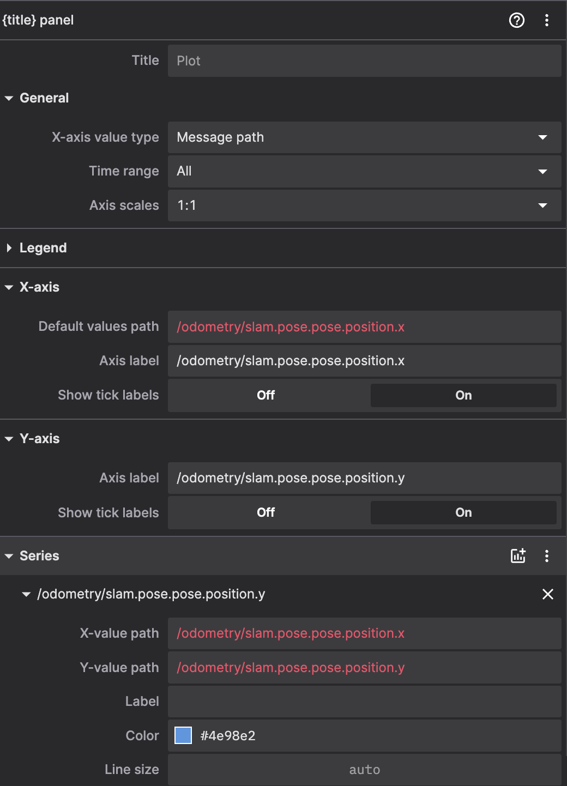

# Инструкция по работе с Raspberry Pi 5 и запуску ORB-SLAM3

Полный цикл: от подключения к сети и первоначальной калибровки IMU до запуска контейнера, настройки камеры, нод, Foxglove и сохранения результатов.

## Оглавление

- [ORB-SLAM3: быстрый старт](#orb-slam3-быстрый-старт)
- [Настройка foxglove](#настройка-foxglove)
- [Перезапуск ORB-SLAM3](#перезапуск-orb-slam3)
- [Сохранение траектории](#сохранение-траектории)
- [Настройка камеры](#настройка-камеры)
- [Настройки и проверка UDP соединения](#настройки-и-проверка-udp-соединения)
- [SSH-подключение](#ssh-подключение)
- [Что не стоит делать](#что-не-стоит-делать)
- [Типичный порядок работы](#типичный-порядок-работы)
- [Дополнительно](#дополнительно)
- [Контакты](#контакты)

---

## ORB-SLAM3: быстрый старт

1. **Подключение к Raspberry Pi**

   * **Wi‑Fi**: точка доступа `kkklll`, пароль `123456780`.
   * **Ethernet**: вставьте кабель в LAN‑порт
   * **Локально**: подключите монитор, клавиатуру и мышь.

   * **Дополнительно**
    После подключения можно подключить другой вайфай
    ```bash
    sudo raspi-config
    ```
    Перейти в параметры устройства и вайфай подключения, далее установить желаемое подключение.

2. **Подключение**
* *macOS/Linux*: `ssh rinat@raspberrypi.local`
* *Windows*: `ssh rinat@<IP_адрес_PI>`
  Пароль: `05203`.

3. **Первая перезагрузка и калибровка IMU**

   ```bash
   sudo reboot
   ```

   Дождитесь 30–40 с для автокалибровки инерциального модуля.

4. **Запуск Docker‑контейнера**

   ```bash
   ./run_container.sh
   ```

   Контейнер автоматически пробросит все камеры, IMU и USB.

5. **Запуск всех нод**

   ```bash
   cd /home
   ./run_nodes.sh --all
   ```

   Для просмотра доступных флагов:

   ```bash
   ./run_nodes.sh
   ```

6. **Чтобы подключить фоксглов, надо скачать его по ссылке https://foxglove.dev/download**
    После нужно в хосте распберри пай написать
    ```bash
    ifconfig # смотрите поле айпи именно того интерфейса,
             # по которому подключено устройство
    ```
    чтобы узнать, какое айпи имеет устройство
    Далее нужно зайти в фоксглов, нажать "open connections", изменить localhost на найденный айпи устройства:
    

7. **Далее нужно настроить фоксглов, выставить нужные виджеты для мониторинга.** 
    См пункт настройка фоксглов

8. **Перезапуск орбслема**
    При необходимости нужно перезапустить орбслем, см пункт перезапускт орбслема

---

## Настройка foxglove
1. Для отображения траектории в 2д, нужно выставить такие настройки в виджете *Plot*

2. Для отображения моментной позы, нужно выбрать в виджете *3D* топик transform или tf
3. Чтобы отобразить текущую картинку, следует в виджете *Image* выбрать топик /camera/image_raw/compressed
4. Для отображения выходных данных орбслема или данных иму, надо выбрать виджет *Raw messages* и подписаться на /odometry/slam и /imu/data_raw соответственно

## Перезапуск ORB-SLAM3

1. Чтобы выполнить перезапуск орбслема, надо остановить текущий процесс орбслема, подав сигнал ctrl+c
2. Заново запустить слем той же командой, подождать 10 секунд до запуска

---

## Сохранение траектории

Избегая `run_nodes.sh` (он убивает процессы), запустите SLAM отдельно:

```bash
# Терминал 1
source /opt/ros/humble/setup.bash
source /home/examples_ws/install/setup.bash
export LD_LIBRARY_PATH=/home/ORB_SLAM3/lib:/usr/local/lib:$LD_LIBRARY_PATH
ros2 launch slam_example slam_example.launch.py

# Терминал 2 (BEZ --slam)
cd /home
./run_nodes.sh --camera --imu --fox --udp
```

Траектория сохранится в `/home/FrameTrajectory.txt`.

---

## Настройка камеры

1. Откройте скрипт:

   ```bash
   cd /home
   nano run_nodes.sh
   ```

   Блок `launch_camera()` — строки \~19–53.

2. Отредактируйте gain в этом блоке:

   ```bash
   -p AnalogueGain:=1.0  # 1.0–6.0 в зависимости от освещённости
                         # чем ниже освещенность, тем больше стоит
                         # выставить гейн
   ```

3. Запустите камеру и Foxglove для проверки:

   ```bash
   ./run_nodes.sh --camera --fox
   ```

5. **Дополнительные параметры** (редко требуются):

```bash
ros2 run camera_ros camera_node \
  --ros-args \
  -p width:=$CAMERA_WIDTH \
  -p height:=$CAMERA_HEIGHT \
  -p camera:=1 \
  -p format:=BGR888 \
  -p orientation:=180 \
  -p role:=still \
  -p sensor_mode:="640:480" \
  \
  # экспозиция вручную (режим 1 = ручной)
  -p ExposureTimeMode:=1 \
  -p ExposureTime:=2000           # 2 ms выдержки \
  \
  # усилитель (gain) вручную
  -p AnalogueGainMode:=1 \
  -p AnalogueGain:=1.0            # гейн, минимальное значение - 1.0 \
  \
  # авто-фликер/мигание и баланс белого
  -p AeFlickerMode:=0             # подавление мерцания ламп (0 = выкл.) \
  -p AwbEnable:=true              # авто-баланс белого \
  -p AwbMode:=0                   # 0 = Auto; можно сменить на 2/3/5 при не-Auto \
  \
  # базовые шум-и-динамика
  -p StatsOutputEnable:=false     # отключаем статистику на чёрный кадр \
  -p HdrMode:=0                   # без HDR, чтобы избежать артефактов \
  -p FrameDurationLimits:="[66666,66666]"  # строго 15 fps, при изменении нужно менять \
                                  # в файле /home/examples_ws/src/slam_example/config/camera_and_slam_settings.yaml \
                                  # задается в формате 1e6/fps
  # удобство качества картинки (лучше не добавлять эти параметры)
  -p Brightness:=0.0              # смещение яркости (–1..+1) \
  -p Contrast:=2.0                # контраст (0..32): 2.0 \
  -p Saturation:=1.0              # насыщенность (0..32): 1.0 = дефолтное цветопередача \
  -p Sharpness:=0.0               # резкость (0..16): 0 = без искусственного шумоподъёма \
  \
  # QoS для публикации
  -p qos_overrides./rover_camera/image_raw.publisher.reliability:=best_effort \
  -p qos_overrides./rover_camera/image_raw.publisher.history:=keep_last \
  -p qos_overrides./rover_camera/image_raw.publisher.depth:=1 \
  \
  -r /camera/image_raw:=/rover_camera/image_raw

```

---

## Настройки и проверка UDP соединения
1. Юдп соединение запускается флагом --udp при запуске нод, так же включено во флаг --all
```bash
./run_nodes.sh --udp
```
2. Бывает такое, что порт не открывается, надо сделать это еще раз вручную.
    Нужно в другом терминале подключится к распберри пай и в хосте выполнить
```bash
ip addr flush dev eth0
ip addr add 10.0.0.1/24 dev eth0
ip link set eth0 up
```

---

## SSH-подключение

* **macOS/Linux**: `ssh rinat@raspberrypi.local`
* **Windows**: `ssh rinat@<IP_адрес_PI>`
  Пароль: `05203`.

---

## Что не стоит делать

1. Трогать объектив и корпус первые 30–40 с после перезагрузки (IMU калибруется).
2. Запускать два одинаковых процесса (два SLAM, две камеры).
3. Делать резкие повороты на месте — лучше плавные дуги.
4. Работать на однотонных поверхностях без текстуры. (слем не находит ключевые точки)

---

## Типичный порядок работы

1. Включить устройство, убедится, что светодиод на плате (в районе камеры, только внутри корпуса) загорелся зеленым. Если нет, то следует переткнуть аккумулятор еще раз
2. Настроить сеть и SSH.
3. Перезагрузить для калибровки IMU.
4. Запустить докер контейнер: `./run_container.sh`.
5. Настроить камеру.
6. Запустить ноды, пример: `./run_nodes.sh --all`.
    Через 10-15 секунд в консоли должны появится сообщение со стейтом
    инициализации слема, координаты пока нули
7. Подключиться к Foxglove.
    Отображатся в фоксглове информация будет через 15-20 секунд после запуска нод
8. При необходимости перезапустить SLAM.

---

## Дополнительно

* Для сбора логов IMU извлеките SD-карту и скопируйте `.bin` файлы.

---

**Контакты**: [t.me/rougenn](https://t.me/rougenn)
